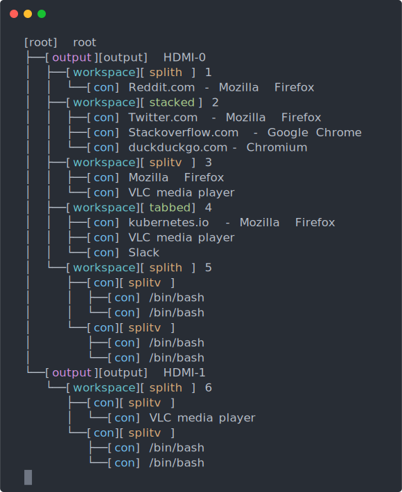

# i3-tree
like [tree](https://linux.die.net/man/1/tree), but for [i3](https://i3wm.org/)

# install
install with
```bash
go get github.com/eh-am/i3-tree
```

# running
```
> i3-tree

[root] root
└──[output][output] HDMI-1
   └──[workspace][splith] 6
      ├──[con][splitv] 
      │  └──[con] VLC media player
      └──[con][splitv] 
         ├──[con] /bin/bash
         └──[con] /bin/bash
```

<!-- Geneated with aha -->
<!--
<pre>
[root] root
├──[<span style="color:purple;">output</span>][output] HDMI-0
│  ├──[<span style="color:teal;">workspace</span>][<span style="filter: contrast(70%) brightness(190%);color:olive;">splith</span>] 1
│  │  └──[<span style="color:blue;">con</span>] Reddit.com - Mozilla Firefox
│  ├──[<span style="color:teal;">workspace</span>][<span style="filter: contrast(70%) brightness(190%);color:green;">stacked</span>] 2
│  │  ├──[<span style="color:blue;">con</span>] Twitter.com - Mozilla Firefox
│  │  ├──[<span style="color:blue;">con</span>] Stackoverflow.com - Google Chrome
│  │  └──[<span style="color:blue;">con</span>] duckduckgo.com - Chromium
│  ├──[<span style="color:teal;">workspace</span>][<span style="color:olive;">splitv</span>] 3
│  │  ├──[<span style="color:blue;">con</span>] Mozilla Firefox
│  │  └──[<span style="color:blue;">con</span>] VLC media player
│  ├──[<span style="color:teal;">workspace</span>][<span style="color:green;">tabbed</span>] 4
│  │  ├──[<span style="color:blue;">con</span>] kubernetes.io - Mozilla Firefox
│  │  ├──[<span style="color:blue;">con</span>] VLC media player
│  │  └──[<span style="color:blue;">con</span>] Slack
│  └──[<span style="color:teal;">workspace</span>][<span style="filter: contrast(70%) brightness(190%);color:olive;">splith</span>] 5
│     ├──[<span style="color:blue;">con</span>][<span style="color:olive;">splitv</span>] 
│     │  ├──[<span style="color:blue;">con</span>] /bin/bash
│     │  └──[<span style="color:blue;">con</span>] /bin/bash
│     └──[<span style="color:blue;">con</span>][<span style="color:olive;">splitv</span>] 
│        ├──[<span style="color:blue;">con</span>] /bin/bash
│        └──[<span style="color:blue;">con</span>] /bin/bash
└──[<span style="color:purple;">output</span>][output] HDMI-1
   └──[<span style="color:teal;">workspace</span>][<span style="filter: contrast(70%) brightness(190%);color:olive;">splith</span>] 6
      ├──[<span style="color:blue;">con</span>][<span style="color:olive;">splitv</span>] 
      │  └──[<span style="color:blue;">con</span>] VLC media player
      └──[<span style="color:blue;">con</span>][<span style="color:olive;">splitv</span>] 
         ├──[<span style="color:blue;">con</span>] /bin/bash
         └──[<span style="color:blue;">con</span>] /bin/bash
</pre>
-->



# help

```
> i3-tree --help

USAGE
  i3-tree

i3-tree generates a user friendly view of the i3 tree

EXAMPLES
# display focused workspace
i3-tree

# display all non empty workspaces
i3-tree all

# show a specific workspace (for example, workspace 6)
i3-tree 6

# show focused workspace, with no colors
i3-tree --render=no-color

# use mock data (useful if you don't have i3 running)
i3-tree --from=mock


FLAGS
  -from i3         where to fetch the tree from. available: [i3 mock]
  -render console  where/how to render the output to. available: [console no-color]
```
